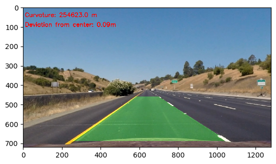

# Advanced Lane Finding Project

## Overview

The detection of lane lines using computer vision approach is implemented in this project.

  

## The goals / steps of this project are the following:

* Compute the camera calibration matrix and distortion coefficients given a set of chessboard images.
* Apply a distortion correction to raw images.
* Use color transforms, gradients, etc., to create a thresholded binary image.
* Apply a perspective transform to rectify binary image ("birds-eye view").
* Detect lane pixels and fit to find the lane boundary.
* Determine the curvature of the lane and vehicle position with respect to center.
* Warp the detected lane boundaries back onto the original image.
* Output visual display of the lane boundaries and numerical estimation of lane curvature and vehicle position.

## Dependencies
If you have already installed all the necessary dependencies for the projects in term 1 you should be good to go! If not, you should install them to get started on this project => [Getting Started for Term 1](https://github.com/woges/UDACITY-self-driving-car/tree/master/term1_How_to_get_started).

## Basic Build Instructions
* Clone or fork this repository.
* Launch the Jupyter notebook: jupyter notebook P4_adv_lane_lines.ipynb
* Execute the code cells you are interested in. Note that cells may depend on previous cells. The notebook explains clearly what each code cell does.

## Project Structure

The code is orgnazed as standalone project in following classes (all code is in directory `./src`):

* `ImageProcessing.py`
 	* camera calibration
 	* image undistortion
 	* perspective transform
 	* color transform
 	* gradient
 	* binary image creating
 	
* `LineDetection.py`
 	* takes binary image
 	* detects left and right lines
 	* applies polynomial fit
 	* calculates curvature and center deviation
 	
* `Line.py`
 	* saves detected lines from N previous frames
 	
* `Pipeline.py`
 	* image pipeline
 	* video pipeline
 

## Pipeline

### 1. Distortion correction

I start by preparing "object points", which will be the (x, y, z) coordinates of the chessboard corners in the world. Here I am assuming the chessboard is fixed on the (x, y) plane at z=0, such that the object points are the same for each calibration image.  Thus, `objp` is just a replicated array of coordinates, and `objpoints` will be appended with a copy of it every time I successfully detect all chessboard corners in a test image.  `imgpoints` will be appended with the (x, y) pixel position of each of the corners in the image plane with each successful chessboard detection.  

I then used the output `objpoints` and `imgpoints` to compute the camera calibration and distortion coefficients using the `cv2.calibrateCamera()` function.  I applied this distortion correction to the test image using the `cv2.undistort()` function and obtained this result: 

To demonstrate this step, I will describe how I apply the distortion correction to one of the test images like this one:

### 2. Color transformations

I used a combination of color and gradient thresholds to generate a binary image (thresholding steps at lines 106 through 171 in `src/ImageProcessing.py`). I also applied a mask to the binary image for accuracy improvement (lines 74 through 104 in `src/ImageProcessing.py`).  Here's an example of my output for this step. 

#### 3. Perspective transform

The code for my perspective transform includes a function called `perspectiveTransform()`, which appears in lines 173 through 191 in the file `src/ImageProcessing.py`. The `perspectiveTransform()` function takes as inputs an image (`img`), as well as source (`src`) points.  I chose the hardcode the source and destination points 

This resulted in the following source and destination points:

| Source        | Destination   | 
|:-------------:|:-------------:| 
| 249, 690      | 249, 720       | 
| 579, 460      | 249, 0           |
| 704, 460      | 1058, 0         |
| 1058, 690    | 1058, 720     |

I verified that my perspective transform was working as expected by drawing the `src` and `dst` points onto a test image and its warped counterpart to verify that the lines appear parallel in the warped image.

### 4. Lane-line pixels identification and polynomial fit

Lane-line pixels were identified by summarizing of all detected points on the warped binary image, which can be lane lines. The highest peacks of this sum correspond to the lane-lines as shown in the picture below:

To detect the lines with curvature the sliding window method was used. The warped binary image is divided in many windows. Then the lane-lines are detected in each window by summarazing of all "activated" points. Finally the detected lines in each window are combined together.
This points are used for polynomial fit of 2nd order for left and right lines, as shown in the picture below:

### 5. Radius of curvature of the lane and the position of the vehicle with respect to center.

The curvature was calculated as mean value of left and right line curvature 176 through 189 in my code in `src/LineDetection.py`.
The assumption, that lane width is 3.7 m and length is 30 m was used to transform the curvature in meters.

### 6. Example image of the pipeline result plotted back down onto the road

I implemented this step in lines 194 through 212 in my code in `src/ImageProcessing.py` in the function `drawLineOnOriginalImage()`.  Here is an example of my result on a test image:

---

## Pipeline (video)

To improve the accuracy and detection speed following steps were introduced to the video pipeline:

* **Tracking**
The detected lines in previous steps can be saved using class `src/Line.py`. It allows to calculate average values for last N frames to smooth the line detection and avoid high deviations

* **Sanity Check**
The detected lines should be checked, if they are really lane-lines (function `sanityCheck()` lines 155 through 174 in my code in `src/LineDetection.py`):
	* Checking that the lines are separated by approximately the right distance horizontally
	* Checking that the lines are roughly parallel
	
	If the detected lines are not a lane-line, it should not be considered, and average values from previous frames are used for current frame
	
* **Look-Ahead Filter**
Once the lane-line was detected in previous frames, it can be used to significantly reduce the search area (function `searchAroundPoly()` lines 93 through 120 in my code in `src/LineDetection.py`)
If the the lane-line cannot be found using reduced search, the full search algorithm with sliding windows will start again.

Here's a [link to my video result](./output-videos/project_video.mp4)

---

## Discussion

#### 1. Discussion about possible weak points of the pipeline and possible improvements

* The weak point of this algorithm is the tuning of pipeline parameters like thresholds, perspective transform points etc. Some of this parameters are hardcoded, which can make this algorithm not accurate for other conditions.
* This algorithm uses many different thresholds to detect the lane-lines. Each threshold has advantages and disadvantages depending on different conditions. The algorithm can be improved, to choose thresholds which detect the lane-lines better for current conditions.
