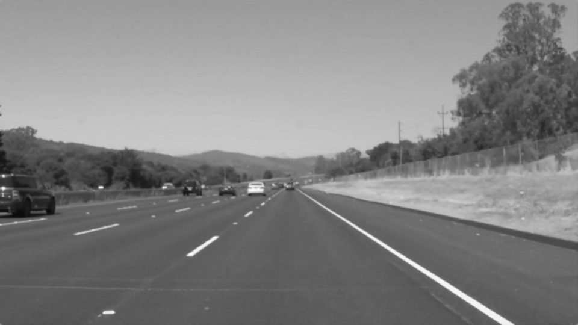
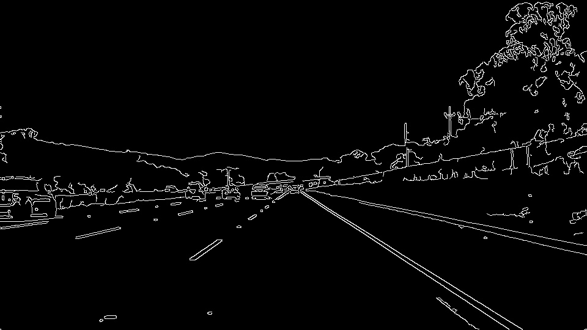
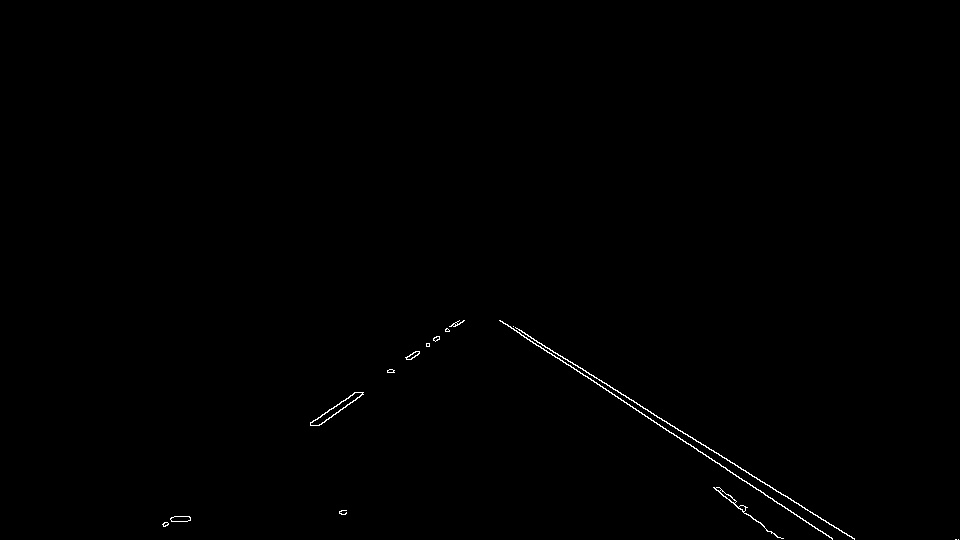
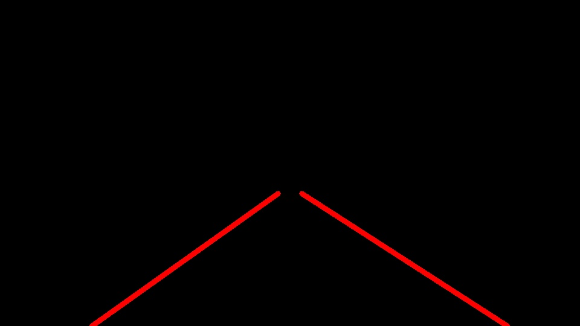
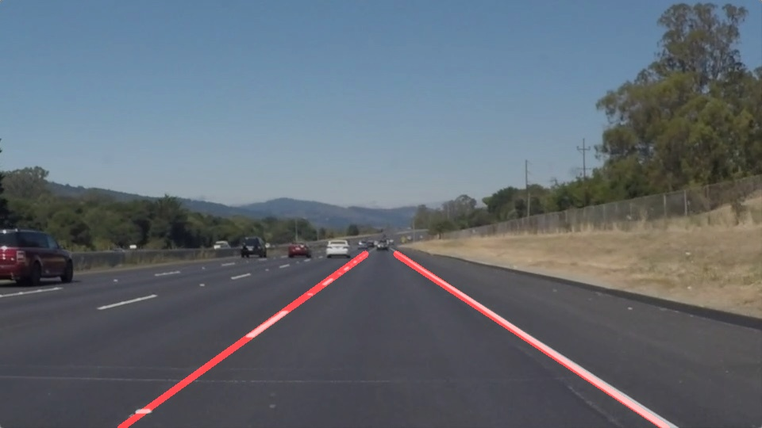

# **Finding Lane Lines on the Road** 

Overview
---

When we drive, we use our eyes to decide where to go.  The lines on the road that show us where the lanes are act as our constant reference for where to steer the vehicle.  Naturally, one of the first things we would like to do in developing a self-driving car is to automatically detect lane lines using an algorithm.

In this project you will detect lane lines in images using Python and OpenCV.  OpenCV means "Open-Source Computer Vision", which is a package that has many useful tools for analyzing images.  

Dependencies
---

If you have already installed the [CarND Term1 Starter Kit](https://github.com/udacity/CarND-Term1-Starter-Kit/blob/master/README.md) you should be good to go!   If not, you should install the starter kit to get started on this project. 

Build Instructions
---

* Clone this repository
* Start Jupyter notebook: jupyter notebook P1.ipynb
* The code cells in the notebook can be executed 

The Project
---

The purpose of this project is to detect lane lines in images and videos from a car camera.
For this goal the detection pipeline was created which can be applied to images and videos.
This pipeline includes following steps for lane lines detection:

* Image conversion to grayscale, applying of Gaussian filter to reduce noize and Canny edge detection

 

* Applying of a mask to the image to separate the region of interest. Using of Hough transformation to detect the lines. The detected lines by Hough transformation are then filtered, averaged and extrapolated for the whole region of interest, which results in two solid red lines for left and right road lane lines

 

* Finally the original image can be combined with detected lines
 

Results
---
 
The resulting videos are in the repository:  ./test_videos_output
