## Project: Build a Traffic Sign Recognition Program
[](http://www.udacity.com/drive)

Overview
---


In this project the deep learning and CNN are used to classify traffic signs. For the neural network training the [German Traffic Sign Dataset](http://benchmark.ini.rub.de/?section=gtsrb&subsection=dataset) is used. After the model is trained it was tested on new German traffic signs images found on the web.

The goals / steps of this project are the following:

* Load the data set (see below for links to the project data set)
* Explore, summarize and visualize the data set
* Design, train and test a model architecture
* Use the model to make predictions on new images
* Analyze the softmax probabilities of the new images


### Dependencies
This lab requires:

* [CarND Term1 Starter Kit](https://github.com/udacity/CarND-Term1-Starter-Kit)

The lab environment can be created with CarND Term1 Starter Kit. Click [here](https://github.com/udacity/CarND-Term1-Starter-Kit/blob/master/README.md) for the details.

### Dataset and Repository

1. Download the [data set](https://s3-us-west-1.amazonaws.com/udacity-selfdrivingcar/traffic-signs-data.zip). This is a pickled dataset in which we've already resized the images to 32x32. It contains a training, validation and test set.
2. Clone the project, which contains the Ipython notebook and the writeup template.
```sh
git clone https://github.com/udacity/CarND-Traffic-Sign-Classifier-Project
cd CarND-Traffic-Sign-Classifier-Project
jupyter notebook Traffic_Sign_Classifier.ipynb
```


### Data Set Summary & Exploration

#### 1. Basic summary of the data set. 

I used the numpy library to calculate summary statistics of the traffic
signs data set: 

* The size of training set is `34799`
* The size of the validation set is `6960`
* The size of test set is `12630`
* The shape of a traffic sign image is `(32, 32, 3)`
* The number of unique classes/labels in the data set is `43`

#### 2. The visualization of the dataset.

Here is an exploratory visualization of the data set. It is a bar chart showing how the data was distributed for training, testing and validation sets.

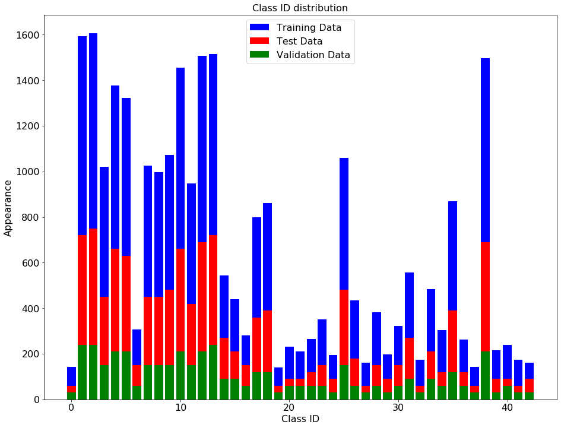

### Model Architecture

#### 1. Image preprocessing

As a first step, I normalized the image data to achieve mean zero and equal variance for the data

Here is an example of a traffic sign image before and after normalization.

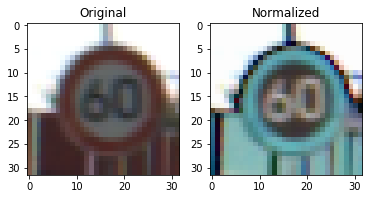


I decided to generate additional data because the original data distribution has not equal amount of images for each sign (class ID).

To add more data to the the data set, I used the image shearing with skimage library. Image shearing changes the perspective of the image, which can make the model more robust. I also experimented with image rotation and image shifting to generate more data, but it make data set large and increases the processing and training time a lot (my laptop was unable to process too large data). Because of that, I did only image shearing.

Here is an example of an original image and an augmented image:

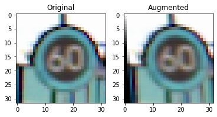

The difference between the original data set and the augmented data set is the perspective of the image. The image shearing is defined randomly. 

Here is the distribution of augmented data:

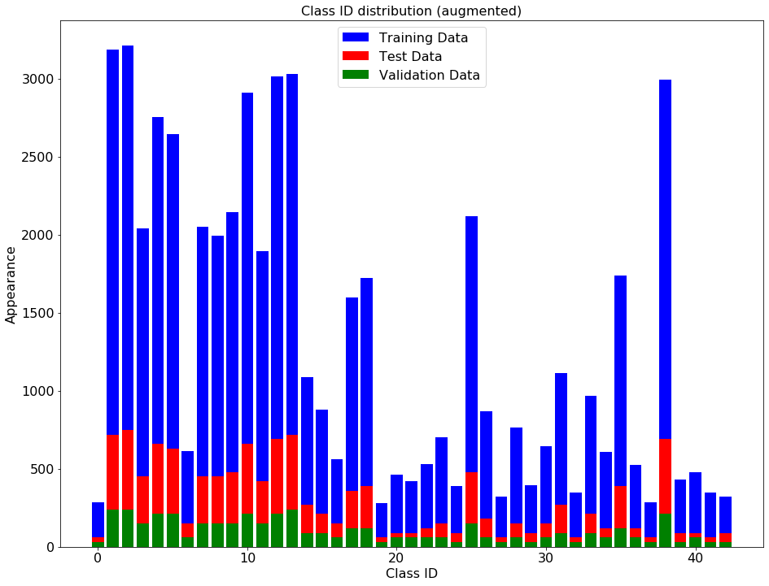

The new size of training set is `55678`

#### 2. The final model architecture

My final model consisted of the following layers:

| Layer         		|     Description	        					| 
|:---------------------:|:---------------------------------------------:| 
| Input         		| 32x32x3 RGB image   							| 
| Convolution 3x3     	| 1x1 stride, same padding, outputs 32x32x32 	|
| RELU					|												|
| Max pooling	      	| 2x2 stride,  outputs 16x16x32				    |
| Convolution 3x3	    | 1x1 stride, same padding, outputs 16x16x64	|
| RELU					|												|
| Max pooling	      	| 2x2 stride,  outputs 8x8x64				    |
| Convolution 3x3	    | 1x1 stride, same padding, outputs 8x8x128	    |
| RELU					|												|
| Max pooling	      	| 2x2 stride,  outputs 4x4x128				    |
| FLATTEN				| outputs 2048									|
| Fully connected		| input 2048, output 512						|
| RELU					|												|
| DROPOUT				| keep probability 0.5							|
| Fully connected		| input 512, output 128						|
| RELU					|												|
| DROPOUT				| keep probability 0.5							|
| Fully connected		| input 128, output 43						|
| RELU					|												|
| DROPOUT				| keep probability 0.5							|
| Softmax				|      									|
|						|												|
|						|												|
 


#### 3. Model training process

To train the model, I used an AdamOptimizer, batch size of 128, 20 epochs, keep probability of 0.5

#### 4. Training result and accuracy

The model has 3 convolution and 3 fully connected layer. I also experimented with other amount of layers, but the current configuration gives the better accuracy. Adding more layers also increases the training time.

My final model results were:

* training set accuracy of 0.993
* validation set accuracy of 0.979 
* test set accuracy of 0.868


The key points are:

* First I tried the model architecture from lecture with 2 convolutional and 3 fully conencted layers. Then I experimented with padding, layer amount and dropout.
* I used SAME padding, so that the feature map is the same size as the input after convolution.
* The stride was chosen 1. The smaller stride increases accuracy, but also increases calculation time. 
* Max pooling was used to decrease the feature map after each convolution layer. 
* The dropout was chosen as 0.5. Dropout helps to prevent overfitting
 

### Test a Model on New Images

#### 1. Here are five German traffic signs that I found on the web:


* The five german signs, which I've found on the web (original resolution 200x200x3) should be resized to 32x32x3 so that this images can be processed by the developed CNN.
* Some information can be lost by images resizing, it can make them difficult for the model to classify.
* This signs are from different sign-groups to test the model on different sign-groups (different shape and color).
* The signs have also different perspective (Yield sign is rotated) and different size (30 km/h is smaller in the image). It can also make this signs difficult for the model to classify.
* The signs have relatively high contrast to the surrounding area, because all images were made by day. The higher contrast can be helpfull for the model to classify. However all signs have the white edge and this can by tricky for model, because by bright surrounding area there is very small contrast to the white sign edge (for example by Yield and 30 km/h signs)


<figure>  
    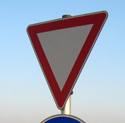     
    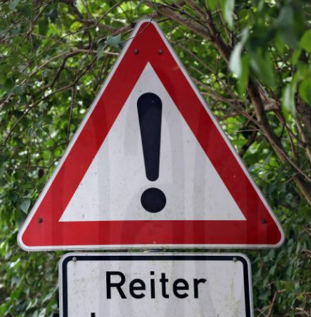
    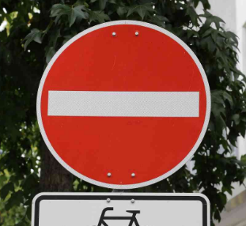 
    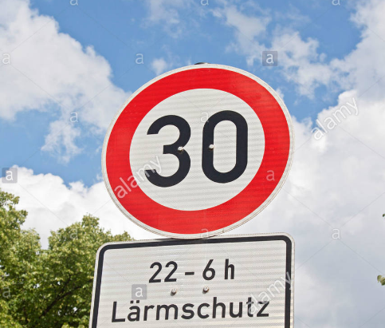 
    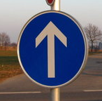 

</figure>


#### 2. The model's predictions on new traffic signs 

Here are the results of the prediction:

| Image			        |     Prediction	        					| 
|:---------------------:|:---------------------------------------------:| 
| Yield      		    | Yield   									    | 
| General caution		| General caution 								|
| No entry				| No entry										|
| 30 km/h	      		| Priority road					 				|
| Ahead only			| Ahead only     							    |


The model was able to correctly guess 4 of the 5 traffic signs.

#### 3. Softmax probabilities distribution


For the first image (Yield), the model is fairly sure that this is a yield (probability of 0.76), the model prediction is right.

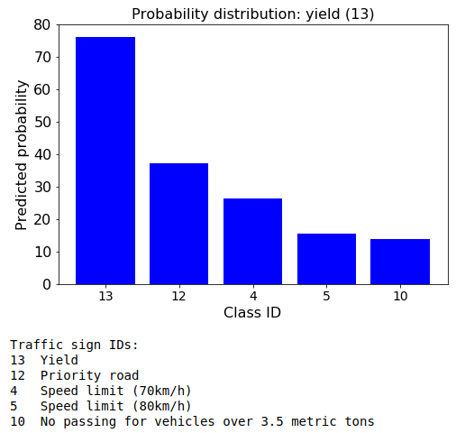  


For the second image (General caution), the model is less sure that this is a general caution sign (probability of 0.32), but the model prediction is still right.

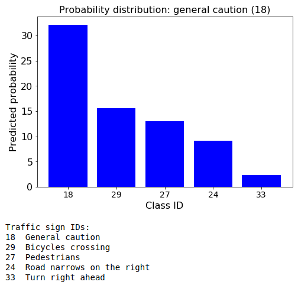  


For the third image (No entry), the model is less sure that this is a no entry sign (probability of 0.30), the model prediction is right.

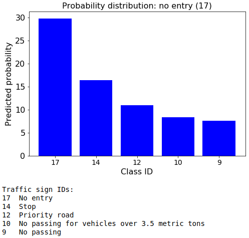  

For the forth image (30 km/h) the model prediction is not right. The reason for the wrong prediction could be different perspective and size of this sign.

  


For the fifth image (Ahead only), the model is relatively sure that this is a ahead only sign (probability of 0.67), the model prediction is right.

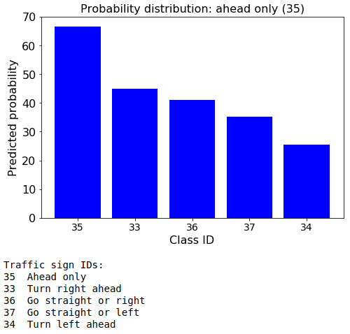 

