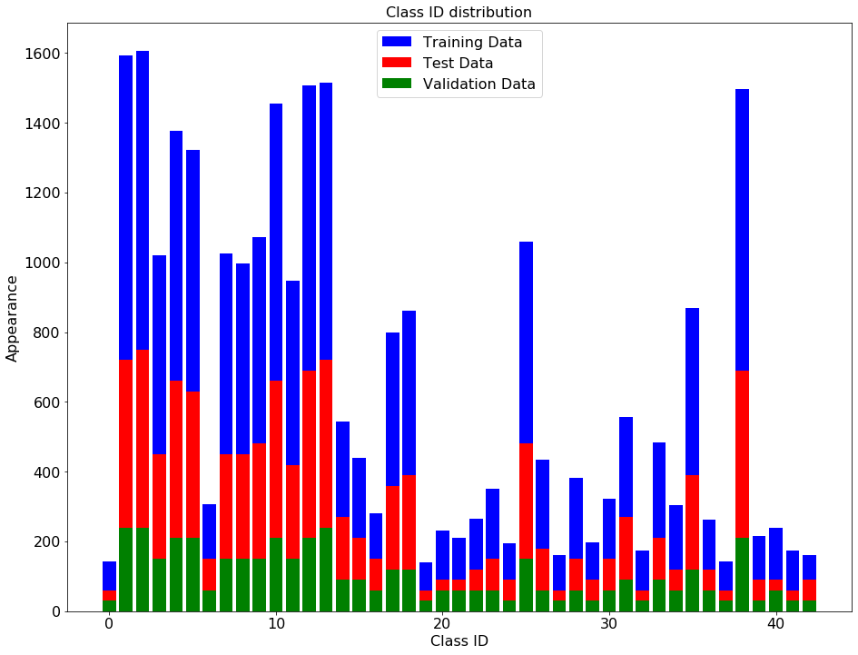
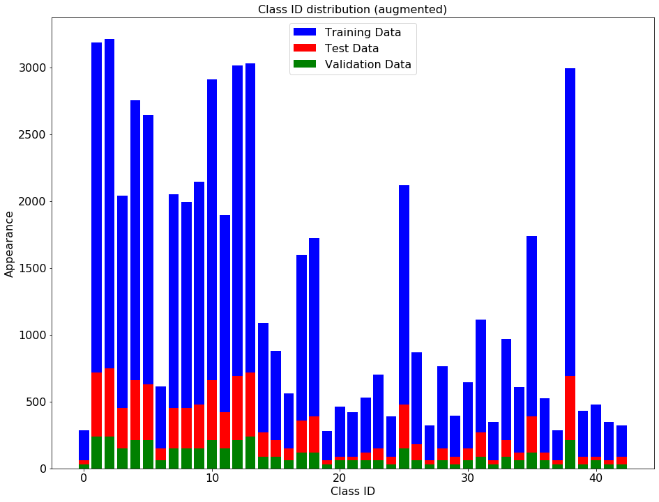
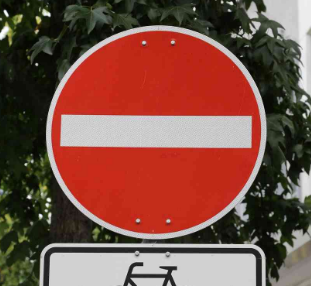
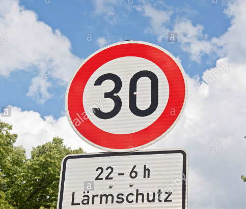
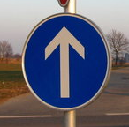
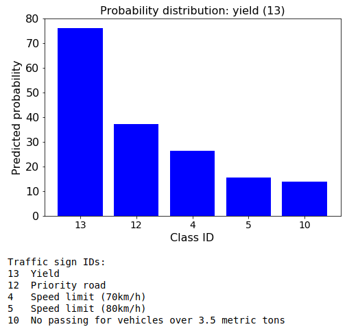
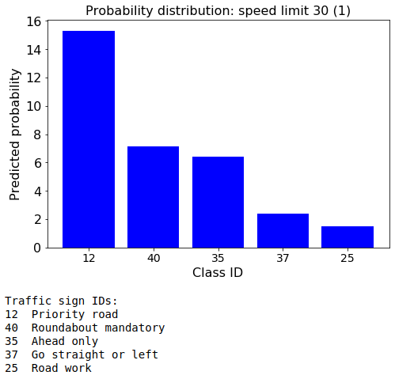

# **Traffic Sign Recognition** 

## Writeup

---

**Build a Traffic Sign Recognition Project**

The goals / steps of this project are the following:

* Load the data set (see below for links to the project data set)
* Explore, summarize and visualize the data set
* Design, train and test a model architecture
* Use the model to make predictions on new images
* Analyze the softmax probabilities of the new images
* Summarize the results with a written report

## Rubric Points
### Here I will consider the [rubric points](https://review.udacity.com/#!/rubrics/481/view) individually and describe how I addressed each point in my implementation.  

---
### Writeup / README

#### 1. Provide a Writeup / README that includes all the rubric points and how you addressed each one. You can submit your writeup as markdown or pdf. You can use this template as a guide for writing the report. The submission includes the project code.

You're reading it! and here is a link to my [project code](./Traffic_Sign_Classifier.ipynb)

### Data Set Summary & Exploration

#### 1. Provide a basic summary of the data set. In the code, the analysis should be done using python, numpy and/or pandas methods rather than hardcoding results manually.

I used the numpy library to calculate summary statistics of the traffic
signs data set: 

* The size of training set is `34799`
* The size of the validation set is `6960`
* The size of test set is `12630`
* The shape of a traffic sign image is `(32, 32, 3)`
* The number of unique classes/labels in the data set is `43`

#### 2. Include an exploratory visualization of the dataset.

Here is an exploratory visualization of the data set. It is a bar chart showing how the data ...

### Design and Test a Model Architecture

#### 1. Describe how you preprocessed the image data. What techniques were chosen and why did you choose these techniques? Consider including images showing the output of each preprocessing technique. Pre-processing refers to techniques such as converting to grayscale, normalization, etc. (OPTIONAL: As described in the "Stand Out Suggestions" part of the rubric, if you generated additional data for training, describe why you decided to generate additional data, how you generated the data, and provide example images of the additional data. Then describe the characteristics of the augmented training set like number of images in the set, number of images for each class, etc.)

As a first step, I normalized the image data to achieve mean zero and equal variance for the data

Here is an example of a traffic sign image before and after normalization.

I decided to generate additional data because the original data distribution has not equal amount of images for each sign (class ID).

To add more data to the the data set, I used the image shearing with skimage library. Image shearing changes the perspective of the image, which can make the model more robust. I also experimented with image rotation and image shifting to generate more data, but it make data set large and increases the processing and training time a lot (my laptop was unable to process too large data). Because of that, I did only image shearing.

Here is an example of an original image and an augmented image:

The difference between the original data set and the augmented data set is the perspective of the image. The image shearing is defined randomly. 

Here is the distribution of augmented data:

The new size of training set is `55678`

#### 2. Describe what your final model architecture looks like including model type, layers, layer sizes, connectivity, etc.) Consider including a diagram and/or table describing the final model.

My final model consisted of the following layers:

| Layer         		|     Description	        					| 
|:---------------------:|:---------------------------------------------:| 
| Input         		| 32x32x3 RGB image   							| 
| Convolution 3x3     	| 1x1 stride, same padding, outputs 32x32x32 	|
| RELU					|												|
| Max pooling	      	| 2x2 stride,  outputs 16x16x32				    |
| Convolution 3x3	    | 1x1 stride, same padding, outputs 16x16x64	|
| RELU					|												|
| Max pooling	      	| 2x2 stride,  outputs 8x8x64				    |
| Convolution 3x3	    | 1x1 stride, same padding, outputs 8x8x128	    |
| RELU					|												|
| Max pooling	      	| 2x2 stride,  outputs 4x4x128				    |
| FLATTEN				| outputs 2048									|
| Fully connected		| input 2048, output 512						|
| RELU					|												|
| DROPOUT				| keep probability 0.5							|
| Fully connected		| input 512, output 128						|
| RELU					|												|
| DROPOUT				| keep probability 0.5							|
| Fully connected		| input 128, output 43						|
| RELU					|												|
| DROPOUT				| keep probability 0.5							|
| Softmax				|      									|
|						|												|
|						|												|
 

#### 3. Describe how you trained your model. The discussion can include the type of optimizer, the batch size, number of epochs and any hyperparameters such as learning rate.

To train the model, I used an AdamOptimizer, batch size of 128, 20 epochs, keep probability of 0.5

#### 4. Describe the approach taken for finding a solution and getting the validation set accuracy to be at least 0.93. Include in the discussion the results on the training, validation and test sets and where in the code these were calculated. Your approach may have been an iterative process, in which case, outline the steps you took to get to the final solution and why you chose those steps. Perhaps your solution involved an already well known implementation or architecture. In this case, discuss why you think the architecture is suitable for the current problem.

The model has 3 convolution and 3 fully connected layer. I also experimented with other amount of layers, but the current configuration gives the better accuracy. Adding more layers also increases the training time.

My final model results were:

* training set accuracy of 0.993
* validation set accuracy of 0.979 
* test set accuracy of 0.868

The key points are:

* First I tried the model architecture from lecture with 2 convolutional and 3 fully conencted layers. Then I experimented with padding, layer amount and dropout.
* I used SAME padding, so that the feature map is the same size as the input after convolution.
* The stride was chosen 1. The smaller stride increases accuracy, but also increases calculation time. 
* Max pooling was used to decrease the feature map after each convolution layer. 
* The dropout was chosen as 0.5. Dropout helps to prevent overfitting
 

### Test a Model on New Images

#### 1. Choose five German traffic signs found on the web and provide them in the report. For each image, discuss what quality or qualities might be difficult to classify.

Here are five German traffic signs that I found on the web:

* The five german signs, which I've found on the web (original resolution 200x200x3) should be resized to 32x32x3 so that this images can be processed by the developed CNN.
* Some information can be lost by images resizing, it can make them difficult for the model to classify.
* This signs are from different sign-groups to test the model on different sign-groups (different shape and color).
* The signs have also different perspective (Yield sign is rotated) and different size (30 km/h is smaller in the image). It can also make this signs difficult for the model to classify.
* The signs have relatively high contrast to the surrounding area, because all images were made by day. The higher contrast can be helpfull for the model to classify. However all signs have the white edge and this can by tricky for model, because by bright surrounding area there is very small contrast to the white sign edge (for example by Yield and 30 km/h signs)

<figure>  
         
    
     
     
     

</figure>

#### 2. Discuss the model's predictions on these new traffic signs and compare the results to predicting on the test set. At a minimum, discuss what the predictions were, the accuracy on these new predictions, and compare the accuracy to the accuracy on the test set (OPTIONAL: Discuss the results in more detail as described in the "Stand Out Suggestions" part of the rubric).

Here are the results of the prediction:

| Image			        |     Prediction	        					| 
|:---------------------:|:---------------------------------------------:| 
| Yield      		    | Yield   									    | 
| General caution		| General caution 								|
| No entry				| No entry										|
| 30 km/h	      		| Priority road					 				|
| Ahead only			| Ahead only     							    |

The model was able to correctly guess 4 of the 5 traffic signs, which gives an accuracy of 80%. This compares favorably to the accuracy on the test set of `0.868`. However the 5 images is too small amount to make conclusions about model accuracy.

#### 3. Describe how certain the model is when predicting on each of the five new images by looking at the softmax probabilities for each prediction. Provide the top 5 softmax probabilities for each image along with the sign type of each probability. (OPTIONAL: as described in the "Stand Out Suggestions" part of the rubric, visualizations can also be provided such as bar charts)

The code for making predictions on my final model is located in the 23th cell of the Ipython notebook.

For the first image (Yield), the model is fairly sure that this is a yield (probability of 0.76), the model prediction is right.

  

For the second image (General caution), the model is less sure that this is a general caution sign (probability of 0.32), but the model prediction is still right.

  

For the third image (No entry), the model is less sure that this is a no entry sign (probability of 0.30), the model prediction is right.

  

For the forth image (30 km/h) the model prediction is not right. The reason for the wrong prediction could be different perspective and size of this sign.

  

For the fifth image (Ahead only), the model is relatively sure that this is a ahead only sign (probability of 0.67), the model prediction is right.

 

