# Behavioral Cloning Project

[](http://www.udacity.com/drive)

Overview
---
This repository contains Udacity Behavioral Cloning Project. The simulator provided by Udacity was used to collect data of human driving. This data was used to train a convolution neural network which was built in this project using Keras library. Finally the CNN was trained to drive the car autonomously around the track.

<p align="center">
  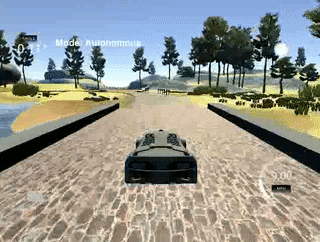
</p>


### Dependencies
This project requires:

* [CarND Term1 Starter Kit](https://github.com/udacity/CarND-Term1-Starter-Kit)

The lab enviroment can be created with CarND Term1 Starter Kit. Click [here](https://github.com/udacity/CarND-Term1-Starter-Kit/blob/master/README.md) for the details.

The following resources can be found in this github repository:
* drive.py
* video.py
* writeup_template.md

The simulator can be downloaded from the classroom. In the classroom, we have also provided sample data that you can optionally use to help train your model.

## Details About Files In This Repository

### `drive.py`

Usage of `drive.py` requires you have saved the trained model as an h5 file, i.e. `model.h5`. See the [Keras documentation](https://keras.io/getting-started/faq/#how-can-i-save-a-keras-model) for how to create this file using the following command:
```sh
model.save(filepath)
```

Once the model has been saved, it can be used with drive.py using this command:

```sh
python drive.py model.h5
```

The above command will load the trained model and use the model to make predictions on individual images in real-time and send the predicted angle back to the server via a websocket connection.

Note: There is known local system's setting issue with replacing "," with "." when using drive.py. When this happens it can make predicted steering values clipped to max/min values. If this occurs, a known fix for this is to add "export LANG=en_US.utf8" to the bashrc file.

#### Saving a video of the autonomous agent

```sh
python drive.py model.h5 run1
```

The fourth argument, `run1`, is the directory in which to save the images seen by the agent. If the directory already exists, it'll be overwritten.

```sh
ls run1

[2017-01-09 16:10:23 EST]  12KiB 2017_01_09_21_10_23_424.jpg
[2017-01-09 16:10:23 EST]  12KiB 2017_01_09_21_10_23_451.jpg
[2017-01-09 16:10:23 EST]  12KiB 2017_01_09_21_10_23_477.jpg
[2017-01-09 16:10:23 EST]  12KiB 2017_01_09_21_10_23_528.jpg
[2017-01-09 16:10:23 EST]  12KiB 2017_01_09_21_10_23_573.jpg
[2017-01-09 16:10:23 EST]  12KiB 2017_01_09_21_10_23_618.jpg
[2017-01-09 16:10:23 EST]  12KiB 2017_01_09_21_10_23_697.jpg
[2017-01-09 16:10:23 EST]  12KiB 2017_01_09_21_10_23_723.jpg
[2017-01-09 16:10:23 EST]  12KiB 2017_01_09_21_10_23_749.jpg
[2017-01-09 16:10:23 EST]  12KiB 2017_01_09_21_10_23_817.jpg
...
```

The image file name is a timestamp of when the image was seen. This information is used by `video.py` to create a chronological video of the agent driving.

### `video.py`

```sh
python video.py run1
```

Creates a video based on images found in the `run1` directory. The name of the video will be the name of the directory followed by `'.mp4'`, so, in this case the video will be `run1.mp4`.

Optionally, one can specify the FPS (frames per second) of the video:

```sh
python video.py run1 --fps 48
```

Will run the video at 48 FPS. The default FPS is 60.

### `download_data.sh`

The Udacity workspace loads the data each time the workspace is started, which takes quite long with a lot of training data. To avoid this problem the training data was stored in Google Drive and can be downloaded when needed for model training using this shell script. 
```sh
./download_data.sh
```

## Project steps

### Data collection with Udacity simulator

The car has three cameras: left, center and right as shown in the picture below. Three cameras result in more data points which is usefull for neural network training.

<p align="center"> 
    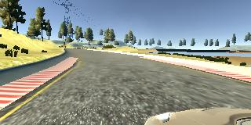     
    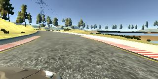 
    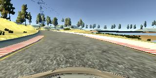
</p>

For each image the corresponding steering angle is saved in a CSV file, which will be used for network training.

The training data was collected by human driving for several loops.

The data ditribution of steering angles is not even, 0 degree steering angle is the most frequent. To improve the data distribution the additional data was collected:

* Additional data only on curves
* Data collection by driving in opposite direction
* Recovery driving

<p align="center">
  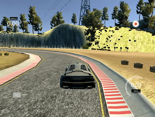
</p>

### Image preprocessing
#### Data augmentation

To icrease the data set and improve the model accuracy the recordered images were augmented by flipping. The steering angle for flipped images became the opposite sign.

<p align="center"> 
    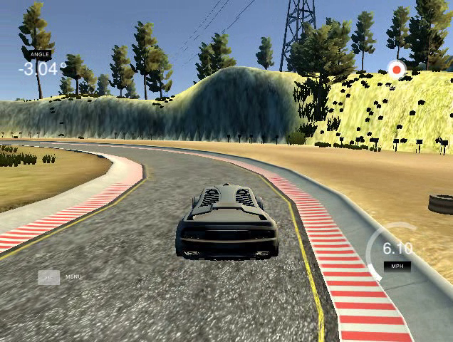     
    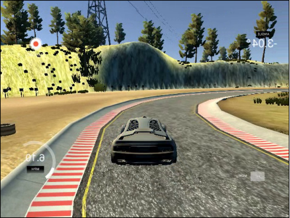
</p>


#### Image cropping

The images were cropped 70 pixels in the top and 20 pixels in the bottom to remove not important parts for netwrok training.

<center>Original image </center>
<p align="center"> 
    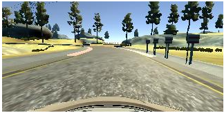     
</p>


<center>Cropped image </center>
<p align="center">   
    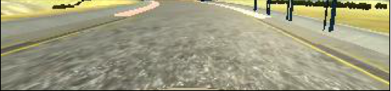
</p>

#### Image normalization

All images from data set were normalized using formula:

`normalized_img = img/127.5 -1`

#### Data splitting

Before model training the data was splitted in the following proportion: 20 % for validation set and 80 % for training set.


### Model architecture

As a starting point the model from [NVIDIA paper](https://images.nvidia.com/content/tegra/automotive/images/2016/solutions/pdf/end-to-end-dl-using-px.pdf) was used. I thought this model might be appropriate because the paper describes the similar topic.

In order to gauge how well the model was working, I split my image and steering angle data into a training and validation set. I found that my first model had a low mean squared error on the training set but a high mean squared error on the validation set. This implied that the model was overfitted. 

To combat the overfitting, I modified the model so that the dropout layers were included.

The final step was to run the simulator to see how well the car was driving around track one. The vehicle fell off the track, mostly by steep curves. To improve the driving behavior in these cases, I added more data with smooth curves driving and also recovery driving from the sidec of the road.

At the end of the process, the vehicle is able to drive autonomously around the track without leaving the road.

The final model architecture  consisted of a convolution neural network with 5 convolutional layers and 3 fully connected layers. First two layers are Lambda-layer for image normalization and Cropping-layer to remove not important image parts.

Here is a visualization of the architecture:


<p align="center">
  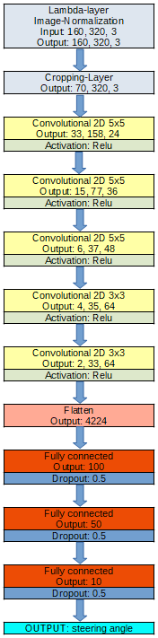
</p>

Befor data augmentation I randomly shuffled the data set and put 20% of the data into a validation set. Only the training set data was augmented.

I used this training data for training the model. The validation set helped determine if the model was over or under fitting. The ideal number of epochs was 8 as evidenced by much slower loss decrease after 8 epochs. I used an adam optimizer so that manually training the learning rate wasn't necessary.

<p align="center">
  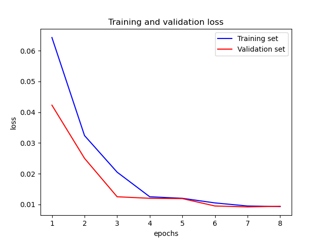
</p>

### Results

The resulting [video](./video.mp4) of autonomous vehicle driving by trained CNN is in the repo.