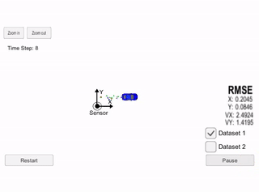
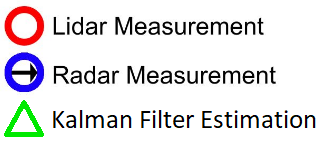
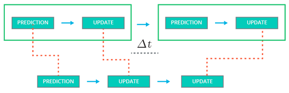
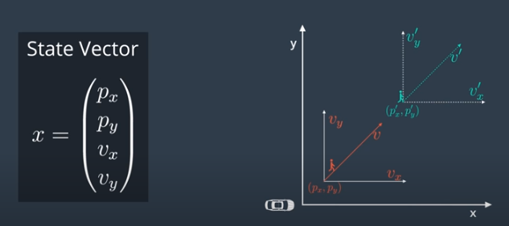
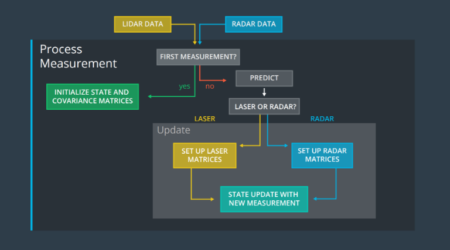
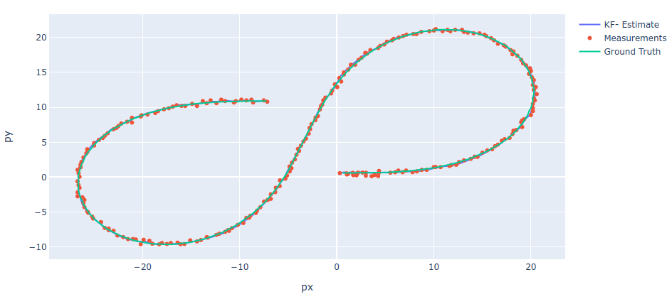

# Extended Kalman Filter Project
Udacity Self-Driving Car Engineer Nanodegree Program

## Overview

In this project an Extended Kalman Filter was utilized in C++ to estimate the state of a moving object of interest using Sensor Fusion of noisy LIDAR and RADAR measurements. 

  

  

The Kalman Filter predicts the objects's state after a time interval using a mathematical model and clarifies the state using the measurement information. 

  

In this project the measurement data is in 2D, so four states are estimated by Kalman Filter: x-position, y-position, x-velocity, y-velocity:

  

Sensor fusion combines LIDAR and RADAR data together to make accurate object tracking with Extended Kalman Filter (EKF):

  

## Dependencies

This project involves the Term 2 Simulator which can be downloaded [here](https://github.com/udacity/self-driving-car-sim/releases).

This repository includes two files that can be used to set up and install [uWebSocketIO](https://github.com/uWebSockets/uWebSockets) for either Linux or Mac systems. For windows you can use either Docker, VMware, or even [Windows 10 Bash on Ubuntu](https://www.howtogeek.com/249966/how-to-install-and-use-the-linux-bash-shell-on-windows-10/) to install uWebSocketIO. Please see the uWebSocketIO Starter Guide page in the classroom within the EKF Project lesson for the required version and installation scripts.

### Other Important Dependencies

* cmake >= 3.5
  * All OSes: [click here for installation instructions](https://cmake.org/install/)
* make >= 4.1 (Linux, Mac), 3.81 (Windows)
  * Linux: make is installed by default on most Linux distros
  * Mac: [install Xcode command line tools to get make](https://developer.apple.com/xcode/features/)
  * Windows: [Click here for installation instructions](http://gnuwin32.sourceforge.net/packages/make.htm)
* gcc/g++ >= 5.4
  * Linux: gcc / g++ is installed by default on most Linux distros
  * Mac: same deal as make - [install Xcode command line tools](https://developer.apple.com/xcode/features/)
  * Windows: recommend using [MinGW](http://www.mingw.org/)

## Basic Build Instructions

1. Clone this repo.
2. Make a build directory: `mkdir build && cd build`
3. Compile: `cmake .. && make` 
   * On windows, you may need to run: `cmake .. -G "Unix Makefiles" && make`
4. Run it: `./ExtendedKF `

## File overview

* main.cpp:
  * Contains interface to Udacity Simulator
* FusionEKF.cpp:
  * Initializes Kalman Filter variables for RADAR and LIDAR data
  * Calls predict and update functions
* kalman_filter.cpp:
  * Contains Extended Klaman Filter algorithms for RADAR and LIDAR
* tools.cpp
  * Contains functions to calculate RMSE and Jacobian matrix
## Results

The resulting Extended Kalman Filter estimations (green) are almost the same as ground truth (blue) in the image below. The visualization was made with [Sensor Fusion Toolkit](https://github.com/udacity/CarND-Mercedes-SF-Utilities) provided by Mercedes team.

  

The Extended Kalman Filter has following RMSE in position and velocity components:

|    | RMSE |
|----|------|
| px | 0.0974     |
| py | 0.0855     |
| vx | 0.4517     |
| vy | 0.4404     |
