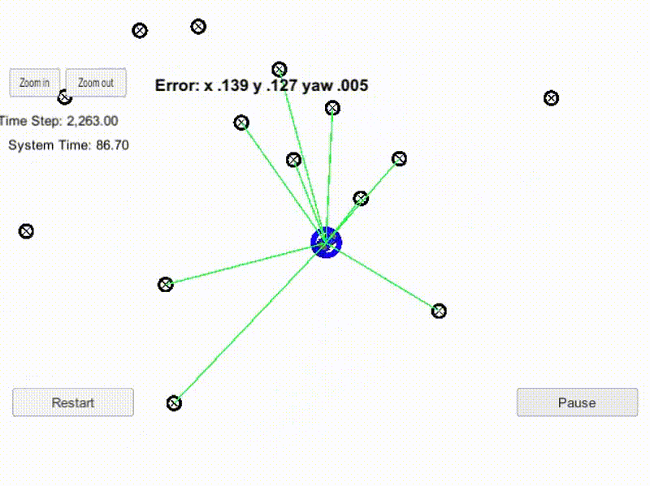

# Particle Filter - Kidnapped Vehicle

Udacity Self-Driving Car Engineer Nanodegree Program

## Overview
In this project a two dimensional particle filter for vehicle localization was implemented in C++. The particle filter will be given a map and some initial localization information (analogous to what a GPS would provide). At each time step the filter will also get observation and control data.

<p align="center">
  
</p>

<center>Particle filter visualization</center>

## Basic Build Instructions
This project involves the Term 2 Simulator which can be downloaded [here](https://github.com/udacity/self-driving-car-sim/releases)

This repository includes two files that can be used to set up and install uWebSocketIO for either Linux or Mac systems. For windows you can use either Docker, VMware, or even Windows 10 Bash on Ubuntu to install uWebSocketIO.

Once the install for uWebSocketIO is complete, the main program can be built and ran by doing the following from the project top directory.

1. mkdir build
2. cd build
3. cmake ..
4. make
5. ./particle_filter


## Goal of this project

Your robot has been kidnapped and transported to a new location! Luckily it has a map of this location, a (noisy) GPS estimate of its initial location, and lots of (noisy) sensor and control data. Does your particle filter localize the vehicle within the desired accuracy? Does your particle run within the specified time of 100 seconds? Does your code use a particle filter to localize the robot?

Running the Term 2 Simulator you can see the path that the car drives along with all of its landmark measurments. The simulator provides the noisy position data, vehicle controls, and noisy observations. The script feeds back the best particle state.

## Particle Filter Algorithm Steps and Inputs

As shown in the picture below, the particle filter algorithm has following steps:
* Initialization
    * initialization of the particles with starting position, orientation and noise. Particles are the random guesses where the vehicle might be. 
* Prediction 
    * predict the new vehicle position in the next time step using known velocity and yaw rate of the vehicle
* Particle weight updates
    * find closest particles to the map landmarks, this particles become higher weight (probability). 
* Resampling
    * the particles with higher weights (probabilities) are considered in next time steps

<p align="center">
  
</p>

<center>Particle filter algorithm</center>

## File structure
The directory structure of this repository is as follows:

```
root
|   build.sh
|   clean.sh
|   CMakeLists.txt
|   README.md
|   run.sh
|
|___data
|   |   
|   |   map_data.txt
|   
|   
|___src
    |   helper_functions.h
    |   main.cpp
    |   map.h
    |   particle_filter.cpp
    |   particle_filter.h
```


## Inputs to the Particle Filter
The inputs to the particle filter are in the `data` directory.

#### The Map*
`map_data.txt` includes the position of landmarks (in meters) on an arbitrary Cartesian coordinate system. Each row has three columns
1. x position
2. y position
3. landmark id

### All other data the simulator provides, such as observations and controls.

> * Map data provided by 3D Mapping Solutions GmbH.

## Results

The simulator displays the best particle's sensed positions [video above](#overview), along with the corresponding map ID associations. The green laser sensors from the car nearly overlap the blue laser sensors from the particle, this means that the particle transition calculations were done correctly. The vehicle position and yaw rate errors stay acceptable low.


