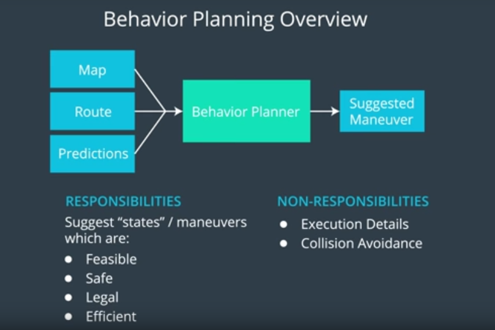
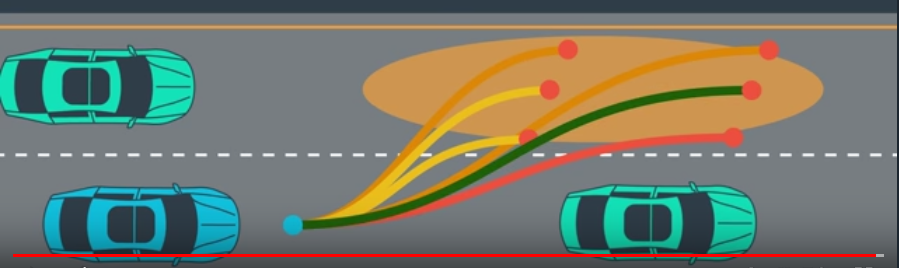
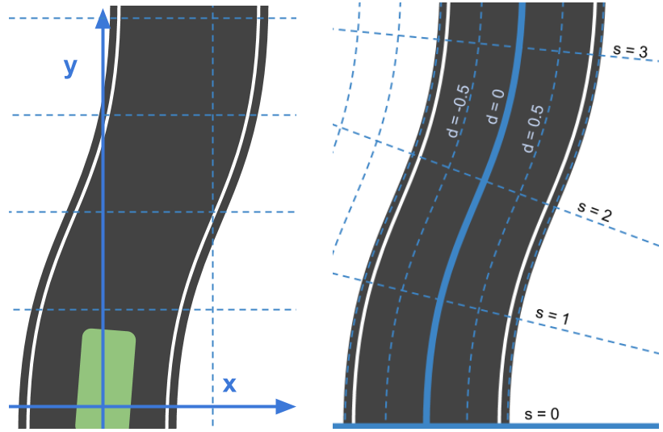
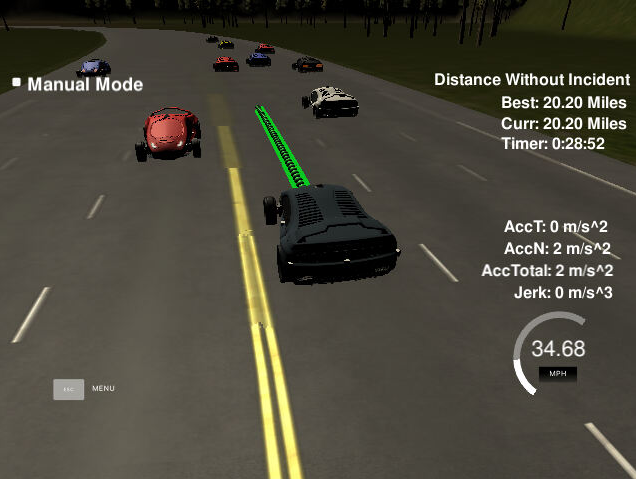

# CarND-Path-Planning-Project
Self-Driving Car Engineer Nanodegree Program
   
## Overview
The goal of this project is to safely navigate around a virtual highway with other traffic that is driving +-10 MPH of the 50 MPH speed limit. The car's localization and sensor fusion data are provided, there is also a sparse map list of waypoints around the highway. The car should try to go as close as possible to the 50 MPH speed limit, which means passing slower traffic when possible, note that other cars will try to change lanes too. The car should avoid hitting other cars at all cost as well as driving inside of the marked road lanes at all times, unless going from one lane to another. The car should be able to make one complete loop around the 6946m highway. Since the car is trying to go 50 MPH, it should take a little over 5 minutes to complete 1 loop. Also the car should not experience total acceleration over 10 m/s^2 and jerk that is greater than 10 m/s^3.

<p align="center">
  
</p>


## Description of the model

### Code Structure

The project has the following structure:
* Class `Vehicle` represents the self-driving car
* Class `Trajectory` represents trajectories of self-driving car for each time step
* Class `helpers` contains helper functions for coordinates transformation, distance measurements and other usefull functions
* The `main.cpp` file contains the interface for Udacity Term3 Simulator
* The `spline.h` [https://kluge.in-chemnitz.de/opensource/spline/](https://kluge.in-chemnitz.de/opensource/spline/) contains usefull functions for smooth trajectory generation using spline

### Path Generation Reflection

The self-driving car path is generated with following steps:

* The behavior planning uses Finite State Machine to decide which path the self-driving car has to drive next. The class `Trajectory` represents 3 states (trajectories): keep lane (KL), change left (CL) and change right (CR). 

<p align="center">
  
</p>

<center>Image: Udacity Self-Driving Car Nanodegree</center>


* This three states (trajectories) are created each time step and for each trajectory the cost is calculated. The cost of each state is needed to decide which maneuver is next for the self-driving car. The cost functions are defined in the class `Trajectory`.
  
* Then the trajectory with smallest cost is chosen in the class `Vehicle`. This trajectory will be driven by self-driving car next.

* The trajectories are calculated using spline from `src/spline/spline.h`, which allows smooth car moving without exceeding of acceptable jerk (10 m/s^3) and acceleration (10 m/s^2).

<p align="center">
  
</p>

<center>Image: Udacity Self-Driving Car Nanodegree</center>

* If the car is behind a vehicle and lane change is not possible, the car adjusts it's speed to keep save distance to the front vehicle. The car speed is changed smoothly with smaller steps to avoid high jerk and acceleration. If the self-driving car gets too close (< 15 m) to the front vehicle then the braking become more intense, but still with considering of acceleration limits.

* In this project the Frenet coordinate system was used. Frenet coordinates simplify the math equations significantly if used on the road as shown in the image below.

<p align="center">
  
</p>

<center>Image: Udacity Self-Driving Car Nanodegree</center>


### Cost Functions

Cost functions are used to chose a proper path for self-driving car. Cost functions defined in the class `Trajectory`, penalize dangerous, wrong or not effective behaviour of self-driving car with following criterias:

* The higher speed is prefered, so the lane has to be changed if the front vehicle is too slow and lane change is possible

* The lane change make sense only if the vehicles on the other lane move faster or the other lane is free

* The lane can be changed only if the gap between vehicles is big enough to avoid collisions. The gap size and minimum front distance are defined in the class `Trajectory`.

* The car doesn't have to go outside of the road, so the cost functions consider the amount of lanes on the road.

* The cost functions return the cost in range between 0.0 and 1.0

## Simulator.
You can download the Term3 Simulator which contains the Path Planning Project from the [releases tab (https://github.com/udacity/self-driving-car-sim/releases/tag/T3_v1.2).  

To run the simulator on Mac/Linux, first make the binary file executable with the following command:
```shell
sudo chmod u+x {simulator_file_name}
```

### The map of the highway is in data/highway_map.txt
Each waypoint in the list contains  [x,y,s,dx,dy] values. x and y are the waypoint's map coordinate position, the s value is the distance along the road to get to that waypoint in meters, the dx and dy values define the unit normal vector pointing outward of the highway loop.

The highway's waypoints loop around so the frenet s value, distance along the road, goes from 0 to 6945.554.

### Here is the data provided from the Simulator to the C++ Program


#### Main car's localization Data (No Noise)

["x"] The car's x position in map coordinates

["y"] The car's y position in map coordinates

["s"] The car's s position in frenet coordinates

["d"] The car's d position in frenet coordinates

["yaw"] The car's yaw angle in the map

["speed"] The car's speed in MPH

#### Previous path data given to the Planner

//Note: Return the previous list but with processed points removed, can be a nice tool to show how far along
the path has processed since last time. 

["previous_path_x"] The previous list of x points previously given to the simulator

["previous_path_y"] The previous list of y points previously given to the simulator

#### Previous path's end s and d values 

["end_path_s"] The previous list's last point's frenet s value

["end_path_d"] The previous list's last point's frenet d value

#### Sensor Fusion Data, a list of all other car's attributes on the same side of the road. (No Noise)

["sensor_fusion"] A 2d vector of cars and then that car's [car's unique ID, car's x position in map coordinates, car's y position in map coordinates, car's x velocity in m/s, car's y velocity in m/s, car's s position in frenet coordinates, car's d position in frenet coordinates. 


## Basic Build Instructions

1. Clone this repo.
2. Make a build directory: `mkdir build && cd build`
3. Compile: `cmake .. && make`
4. Run it: `./path_planning`.


## Dependencies

* cmake >= 3.5
  * All OSes: [click here for installation instructions](https://cmake.org/install/)
* make >= 4.1
  * Linux: make is installed by default on most Linux distros
  * Mac: [install Xcode command line tools to get make](https://developer.apple.com/xcode/features/)
  * Windows: [Click here for installation instructions](http://gnuwin32.sourceforge.net/packages/make.htm)
* gcc/g++ >= 5.4
  * Linux: gcc / g++ is installed by default on most Linux distros
  * Mac: same deal as make - [install Xcode command line tools]((https://developer.apple.com/xcode/features/)
  * Windows: recommend using [MinGW](http://www.mingw.org/)
* [uWebSockets](https://github.com/uWebSockets/uWebSockets)
  * Install from source, checkout to commit `e94b6e1`, i.e.
    ```
    git clone https://github.com/uWebSockets/uWebSockets 
    cd uWebSockets
    git checkout e94b6e1
    ```


## Results

<p align="center">
  
</p>
<center>20 miles without incidents</center>

The developed solution works well for this project. The self-driving car was able to drive more than 20 miles and 28 minutes long without acidents. However there are improvement possibilities. For example, the motion model of surrounding vehicles can be improved by considering of not constant speed. Also the prediction step can be improved to predict vehicles position in the future and make self-driving car behaviour more safe.
