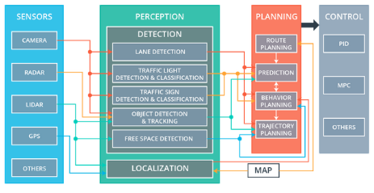
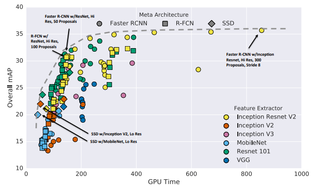
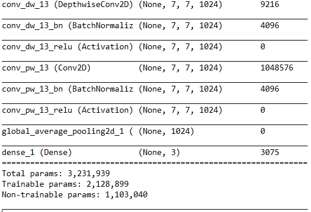
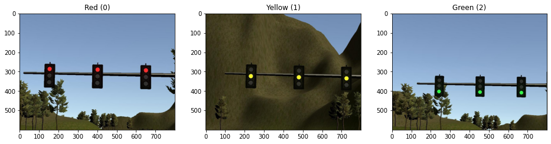

# Capstone System Integration Project: Programming a Real Self-Driving Car

## Overview

This is the final project of the Udacity Self-Driving Car Nanodegree: Programming a Real Self-Driving Car. The goal of this project is to make the Self-Driving Car able to drive on the test track by following the waypoints and stopping on traffic lights.

<p align="center">
  
</p>


## Description

The self-driving car in this project has 4 subsystems: Sensor, Perception, Planning and Control, which functionality is implemented using Robot Operating System (ROS):

<p align="center">
  
</p>

<center>Image: Udacity Self-Driving Car Nanodegree</center>

### Sensor: 

* Sensors are hardware components to observe the world.
* In the project the sensor's data is simulated by Udacity simulator:
  * Camera images
  * Vehicle position
  * Vehicle velocity
  

### Perception:

* Perception subsytem processes the sensor data for further analysis

### Planning:

* Planning subsystem uses the data from perception subsystem for route planning, behavior planning, trajectory planning

### Control:

* Control subsystem uses PID and Model Predictive Control techniques to control the vehicle behaviour according to the data from planning subsystem


## Installation


* Be sure that your workstation is running Ubuntu 16.04 Xenial Xerus or Ubuntu 14.04 Trusty Tahir. [Ubuntu downloads can be found here](https://www.ubuntu.com/download/desktop).
* If using a Virtual Machine to install Ubuntu, use the following configuration as minimum:
  * 2 CPU
  * 2 GB system memory
  * 25 GB of free hard drive space

  The Udacity provided virtual machine has ROS and Dataspeed DBW already installed, so you can skip the next two steps if you are using this.

* Follow these instructions to install ROS
  * [ROS Kinetic](http://wiki.ros.org/kinetic/Installation/Ubuntu) if you have Ubuntu 16.04.
  * [ROS Indigo](http://wiki.ros.org/indigo/Installation/Ubuntu) if you have Ubuntu 14.04.
* [Dataspeed DBW](https://bitbucket.org/DataspeedInc/dbw_mkz_ros)
  * Use this option to install the SDK on a workstation that already has ROS installed: [One Line SDK Install (binary)](https://bitbucket.org/DataspeedInc/dbw_mkz_ros/src/81e63fcc335d7b64139d7482017d6a97b405e250/ROS_SETUP.md?fileviewer=file-view-default)
* Download the [Udacity Simulator](https://github.com/udacity/CarND-Capstone/releases).


### Usage

1. Clone the project repository

2. Install python dependencies
```bash
cd CarND-Capstone
pip install -r requirements.txt
```
3. Make and run styx
```bash
cd ros
catkin_make
source devel/setup.sh
roslaunch launch/styx.launch
```
4. Run the simulator


## Implementation Details

### Perception Subsystem

ROS-Node: `ros/src/tl_detector`

Model training: `train_model/fine_tuning.py`


#### Model choice

To detect the traffic light states the Keras pretrained model [MobileNet](https://keras.io/api/applications/mobilenet/) was used. The model becomes camera images as input and predicts traffic light states. MobileNet model was chosen because of it's small weight and lower amount of parameters, which improves the prediction speed, but reduces the accuracy, as described in Paper ["Speed/accuracy trade-offs for modern convolutional object detectors"](https://arxiv.org/abs/1611.10012):

<p align="center">
  
</p>

Image: ["Speed/accuracy trade-offs for modern convolutional object detectors"](https://arxiv.org/abs/1611.10012) 


In this project the higher prediction speed of the model is important to avoid latency, so the MobileNet model was chosen.

#### Model fine tunning

The MobileNet was finetuned to detect the traffic lights. The last 6 layers were removed and the Dense layer with 3 outputs (RED=0, YELLOW=1, GREEN=2) was added. Finally all layers in the model except of last 23 were frozen. The number of layers to remove and the number of layers to freeze were chosen experimentally.

<p align="center">
  
</p>

<center>Model summary, last layers</center>

#### Model training

The images dataset [(can be downloaded from Google Drive)](https://drive.google.com/file/d/1JVxefOFLK09zeEBP2ze3vvwoxbCLyCdg/view?usp=sharing) for model training is 3000 traffic light images in total: 1000 images with green light, 1000 images with yellow light and 1000 images with red light. All images were captured in Udacity simulator using `image_color` message published from the simulator. Finally all images were splitted in training, validation and test datasets: 70%, 20% and 10% accordingly. 


<p align="center">
  
</p>

<center>Traffic light images from Udacity simulator, used for model training</center>


The following hyperparameters were used for model training:

* 4 epochs (was already enough to achieve 98% of validation accuracy) 
* batch_size: 10 
* learning_rate: 0.0001


### Planning Subsystem

The Waypoint Updater ROS-Node: `ros/src/waypoint_updater/waypoint_updater.py`

This subsystem takes the simulator data as input: 
* Current vehicle position 
* The [base waypoints of the simulator treck](/data/sim_waypoints.csv) 
* The traffic light state (RED=0, YELLOW=1, GREEN=2) predicted in Perception Subsystem using simulator camera.

Finally the Waypoint Updater publishes next 50 waypoints of the current vehicle position, together with the velocity that the vehicle has to have at this points. If the red traffic light was detected in front of the car, the vehicle's speed decelerates with quadratic law for smooth behavior.

### Control Subsystem

The Drive-By-Wire (DBW) ROS-Node: `ros/src/twist_controller`

Thes subsystem takes the following data as input:
* Final waypoints calculated and published in Planning Subsystem
* Current vehicle velocity from simulator

The DBW node adjusts steering, throttle and brake values according to final waypoints from Waypoint Updater node:
* Steering is adjusted using predictive control, implemented in [YawController.py](ros/src/twist_controller/yaw_controller.py)
* Throttle and brake are adjusted using PID controller, implemented in [pid.py](ros/src/twist_controller/pid.py)


## Results

The Self-Driving Car is able to drive automatically on the Udacity test track in simulator. The vehicle follows smoothly the waypoints and stops on traffic lights if needed. The trajectory of the Self-Driving Car is calculated to avoid hight accelerations and jerks.


## License

Capstone Project System Integration results are released under [MIT License](LICENSE)
