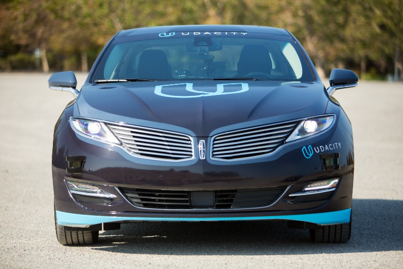
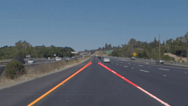
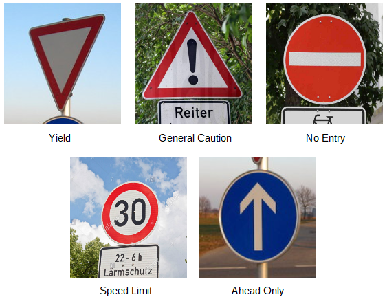
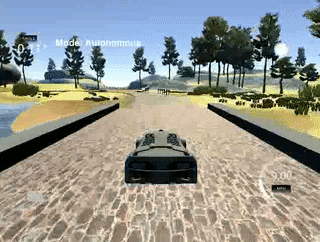
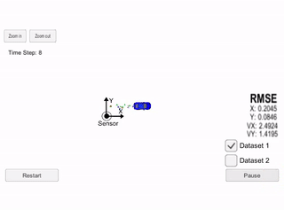
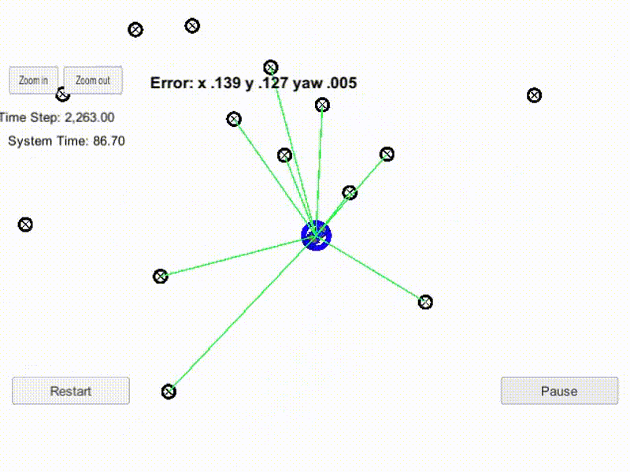

# Udacity Self-Driving Car Engineer Nanodegree Projects

## Overview

This repository contains projects completed during [Udacity Self-Driving Car Engineer Nanodegree Program](https://www.udacity.com/course/self-driving-car-engineer-nanodegree--nd013).

  

Image: [Udacity Self-Driving Car Nanodegree](https://github.com/udacity/self-driving-car/blob/master/images/car.jpeg)

## Projects completed during Udacity Self-Driving Car Engineer Nanodegree

## Term 1: Computer Vision and Deep Learning

### 1. [Lane Lines Finding on the Road](https://github.com/alekseikruglov/Udacity-Self-Driving-Car-Engineer-Nanodegree-projects/tree/master/CarND-LaneLines-P1)

* **Summary:** Detect the lane lines on the road using car camera data, computer vision techniques and OpenCV library.

* **Keywords:** Computer Vision, Python, OpenCV, Image Processing

  

### 2. [Advanced Lane Lines Finding on the Road](https://github.com/alekseikruglov/Udacity-Self-Driving-Car-Engineer-Nanodegree-projects/tree/master/CarND-Advanced-Lane-Lines-P2)

* **Summary:** Detect the lane lines on the road with higher accuracy using such computer vision techniques as: distortion correction, color and perspective transform, thresholds and gradients.

* **Keywords:** Computer Vision, Python, OpenCV, Image Processing

  

### 3. [Traffic Sign Classifier](https://github.com/alekseikruglov/Udacity-Self-Driving-Car-Engineer-Nanodegree-projects/tree/master/P3_CarND-Traffic-Sign_Classifier)

* **Summary:** Train a Convolutional Neural Network (CNN) using Tensorflow to classify traffic signs on the images.

* **Keywords:** Python, Tensorflow, CNN, Deep Learning, Data Processing, Data Augmentation

  

### 4. [Behavioral Cloning](https://github.com/alekseikruglov/Udacity-Self-Driving-Car-Engineer-Nanodegree-projects/tree/master/P4_Behavioral_Cloning)

* **Summary:** Train a Convolutional Neural Network (CNN) to drive a car autonomously around the track using vehicle camera data

* **Keywords:** Python, Tensorflow, CNN, Deep Learning, Data Processing, Data Augmentation

  

## Term 2: Sensor Fusion, Localization and Control

### 5. [Extended Kalman Filter](https://github.com/alekseikruglov/Udacity-Self-Driving-Car-Engineer-Nanodegree-projects/tree/master/P5_Extended_Kalman_Filter)

* **Summary:** Implement an Extended Kalman Filter to estimate the state of a moving vehicle using Sensor Fusion of noisy LIDAR and RADAR measurements

* **Keywords:** C++, Sensor Fusion, Localization, LIDAR, RADAR, Kalman Filter

  

### 6. [Particle Filter](https://github.com/alekseikruglov/Udacity-Self-Driving-Car-Engineer-Nanodegree-projects/tree/master/P6_Particle_Filter_Kidnapped_Vehicle)

* **Summary:** Implement a two dimensional particle filter for vehicle localization using noisy sensor data

* **Keywords:** C++, Sensor Fusion, Localization, Prediciton, Particle Filter

  

### 7. [Path Planning](https://github.com/alekseikruglov/Udacity-Self-Driving-Car-Engineer-Nanodegree-projects/tree/master/P7_Path_Planning)

* **Summary:** Generate optimal vehicle trajectory to navigate around a highway together with other traffic with maximum possible velocity and minimum acceleration and jerk

* **Keywords:** C++, Localization, Sensor Fusion, Trajectory generation, Prediciton, Frenet Coordinates, Cost Functions

  

### 8. [PID-Control](https://github.com/alekseikruglov/Udacity-Self-Driving-Car-Engineer-Nanodegree-projects/tree/master/P8_PID_Controller)

* **Summary:** Implement and tune a PID controller to control the car's steering angle for driving along the track

* **Keywords:** C++, PID-Control, Parameter Tuning

  

## [Term 3: Final Project: System Integration](https://github.com/alekseikruglov/Udacity-Self-Driving-Car-Engineer-Nanodegree-projects/tree/master/P9_Capstone_System_Integration)

* **Summary:** The goal of this project is to make the Self-Driving Car able to drive on the test track by following the waypoints and stopping on traffic lights using techniues learned in this course: Computer Vision, CNN Image Classification, Localization, Behavior Planning, Control

* **Keywords:** ROS (Robot Operation System), Python, Computer Vision, CNN fine tuning, Traffic Lights Detection, Sensor Fusion, Behavior and Trajectory Planning, PID- and MPC-Control

  

## License

Udacity Self-Driving Car Engineer Nanodegree results are released under the [MIT License](LICENSE).